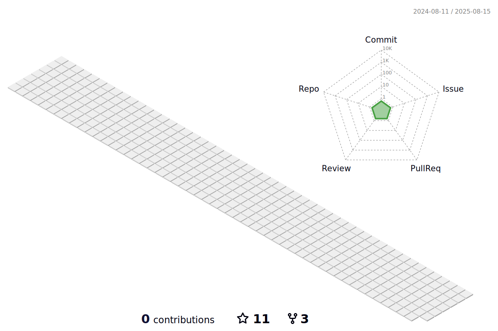

## 📌 About me

</img>  
<!--

-->
  
Hello 👋  
My name is Woody, and I work as a backend developer.

I have a keen interest in creating value through data and strive to grow every day into a more meticulous and skillful developer than I was yesterday. My focus lies in writing clean, efficient, and maintainable code while continuously exploring new technologies and methodologies to improve my craft.

Currently, I am developing services based on **geospatial information (GIS)**, aiming to solve real-world problems and deliver meaningful user experiences. I am driven by a curiosity for innovation and a commitment to leveraging data to unlock its full potential in creating impactful solutions.  

Thank you for visiting, and I hope you have a great day!

<!--

- 👋 Hi, I’m Woody. 
  
-->

- <code>Contact</code> : woody35545@gmail.com  
  

<!--
- <code>Blog</code> : https://velog.io/@woody35545 
  
-->
  
## 📌 Stacks
 

   

   

<!--
## Languages

</img>  

- 👀 Laguages: C, Java, Python.. 

     
-->

<!--
## About github works

</img>  
   
   
   
     

## Just for fun
  
-->  
<!--
## Just for fun

     
-->

## 📌 Contributions

